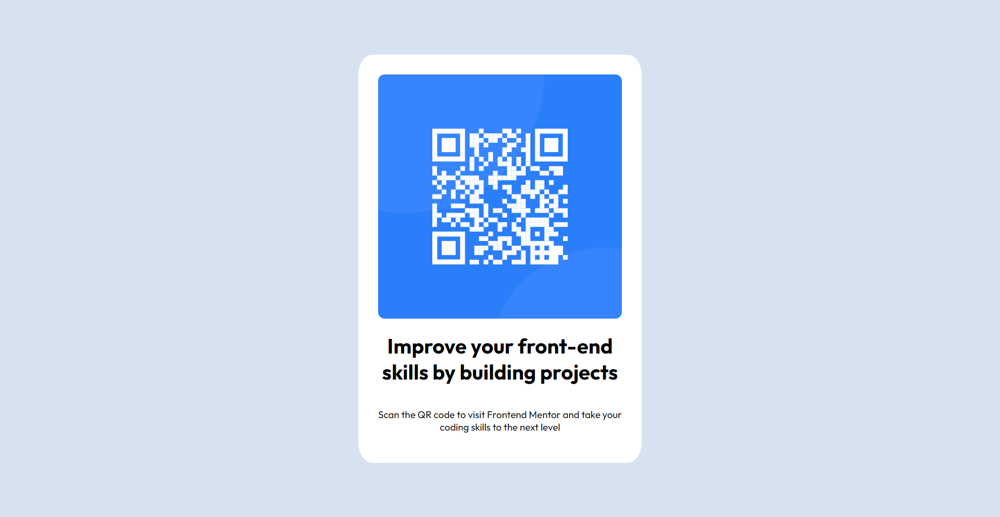

# Frontend Mentor - QR code component solution

This is a solution to the [QR code component challenge on Frontend Mentor](https://www.frontendmentor.io/challenges/qr-code-component-iux_sIO_H). Frontend Mentor challenges help you improve your coding skills by building realistic projects. 

## Table of contents

- [Overview](#overview)
  - [Screenshot](#screenshot)
  - [Live Site](#live-site)
- [My process](#my-process)
  - [Built with](#built-with)
  - [What I learned](#what-i-learned)
  - [Continued development](#continued-development)
  - [Useful resources](#useful-resources)
- [Author](#author)

## Overview

### Screenshot

### Live Site

[Github Pages](https://staedti.github.io/frontendmentor-qr-code/)

## My process
First i got style declarations into the html-document by using :root-Variables for the colors.
Defining Font via embed Google Font Outline in Head and defining body-tag for font-family and classes for regular and bold.

After then i building the structure of the body:
div with id "container" to catch Image, H1 and Paragraph
Embedding QR-Code-Image with img-tag
Writing H1
Writing p
Styling container with white background, aligning with flexbox.

### Built with

- Semantic HTML5 markup
- CSS custom properties
- Flexbox
- Mobile-first workflow

### What I learned

I'm working a lot with wordpress and Enfold-Theme. So it is useful to see, that development from scratch not as easy as it often looks, when i only read code on instagram. I thankful for the beginning of this journey to become a real developer.

### Continued development

Flexbox is always a riddle. More practice there will be useful for the future.
Media Queries are always the same.

### Useful resources

- [Flexbox Guide](https://css-tricks.com/snippets/css/a-guide-to-flexbox/#aa-background) - This helped me to unterstand how i can display various containers on the website
- [W3 schools](https://www.w3schools.com/css/css3_mediaqueries_ex.asp) - Always a good resource to understand html and css :-)

## Author
- Frontend Mentor - [@staedti](https://www.frontendmentor.io/profile/staedti)

